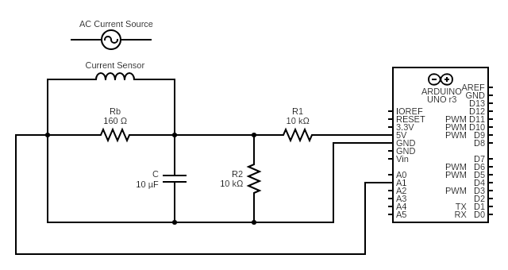
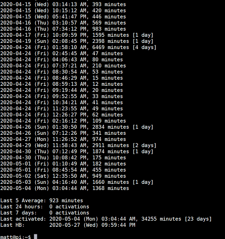

# Arduino Current Monitor

## Summary
This project is intended to track sump pump activations using a current sensor monitor. When activated, the pump draws significant current (about 4 Amps), and lasts several seconds, so it's easy to detect activations and prevent false alerts. With some minor changes, this project could also be modified to monitor the usage of almost any AC-powered appliance. 

## Concept
- A non-invasive clamp sensor is able to detect current draw in an AC appliance. 
- In order to perform the measurement, the AC current is stepped down to safe levels and converted to a voltage using a [combination burden resistor/voltage divider circuit](https://learn.openenergymonitor.org/electricity-monitoring/ct-sensors/interface-with-arduino). 
- An Arduino Uno measures the relative output voltage of the circuit using its Analog A1 port, and is able to produce a current measurement based on the relative output voltage level.
- A Python script running on a Raspberry Pi queries the Arduino for a measurement about 3 times per second.
- The script reads the output of these measurement and evaluates whether the pump has been activated. 
- If an activation is detected, it is logged with a timestamp. If someone wants to review activity, the log file is parsed into human-readable format by another script.

## Current Monitor Circuit
The current monitor circuit is depicted below. In this configuration it is capable of monitoring about 0.5-12 Amps of current.  By changing the values of R1, R2, and Rb, the circuit can be modified for peak values ranging from 1-100 amps (see the [OEMP calculator tool](https://tyler.anairo.com/projects/open-energy-monitor-calculator)). The OEMP documentation contains a good rundown of the [EE theory](https://learn.openenergymonitor.org/electricity-monitoring/ctac/ct-and-ac-power-adaptor-installation-and-calibration-theory) and [calculations required](https://learn.openenergymonitor.org/electricity-monitoring/ct-sensors/interface-with-arduino) to build this kind of circuit.  

## Software Used
- Raspbian OS
- Arduino IDE
- Python
- [Emonlib - Open Energy Monitor Library](https://github.com/openenergymonitor/EmonLib)
- [Shelly](https://apps.apple.com/us/app/shelly-ssh-client/id989642999) (for access from iPhone - $3.99)

## Hardware Used
- [Raspberry PI 3 Model B](https://www.raspberrypi.org/products/raspberry-pi-3-model-b/) - $24.99
- [Arduino Uno R3](https://www.amazon.com/gp/product/B008GRTSV6/ref=ppx_yo_dt_b_search_asin_title?ie=UTF8&psc=1) - $16
- SCT-013-000 Non-invasive AC Current Sensor Split Core Transformer 100A (for two) - $15.98
- [Etekcity Digital Clamp Meter Multimeter](https://www.amazon.com/gp/product/B00NWGZ4XC/ref=ppx_yo_dt_b_search_asin_title?ie=UTF8&psc=1) (Optional - for verification) - $27.99
- [Breadboard holder](https://www.amazon.com/gp/product/B01LYZOPR0/ref=ppx_yo_dt_b_search_asin_title?ie=UTF8&psc=1) (Optional) - $7
- [AC Line Splitter](https://www.amazon.com/Tekpower-M920-Line-Splitter-Separator/dp/B003A0MD48) (Optional) - $12.95
- Other parts: breadboard, jumper cables, resistors, totaling under $20

## Key files in repo
current_monitor.ino 
- Current monitor script running on Arduino
- When requested, reads current and sends measurement to serial port interface 

arduino_current_monitor.py 
- Requests a current measurement at set interval 
- Monitors output of current_monitor.ino via serial port interface
- Evaluates whether current indicates a pump activation 
- Stores all pump activations to log file with timestamp
- Logs a periodic "heartbeat" which helps determine system uptime
- Suggestion: configure this script to run at boot time so the current monitor is always running in the background

current_stats.py
- Reads log files
- Prints log results to console in a human-readable format

## Sample Output

The current_stats.py script can produce console logs such as the following, which give a log of all recent pump activations:

